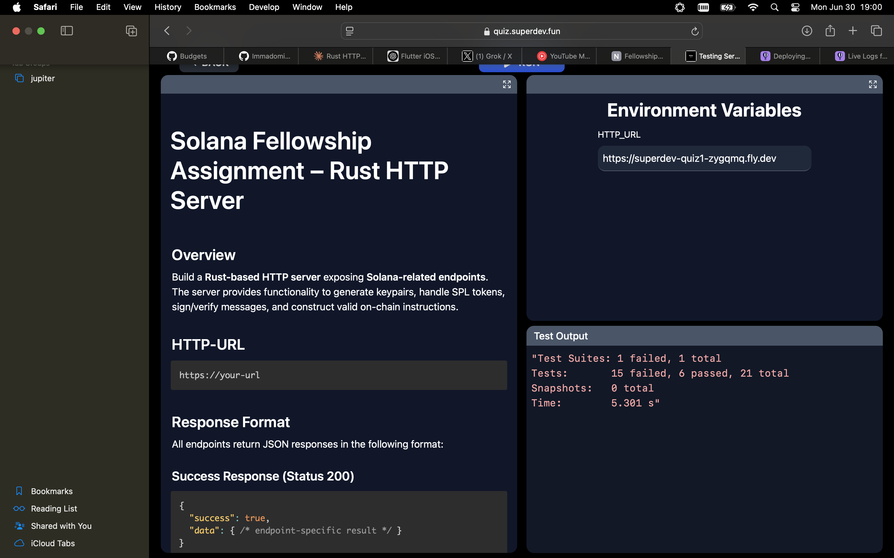

# Solana Fellowship Assignment – Rust HTTP Server

## Superdev Test 1

## Endpoints

- `POST /keypair` – Generate Solana keypair
- `POST /token/create` – Create SPL token mint instruction
- `POST /token/mint` – Mint SPL tokens
- `POST /message/sign` – Sign a message
- `POST /message/verify` – Verify a signed message
- `POST /send/sol` – Create SOL transfer instruction
- `POST /send/token` – Create SPL token transfer instruction
